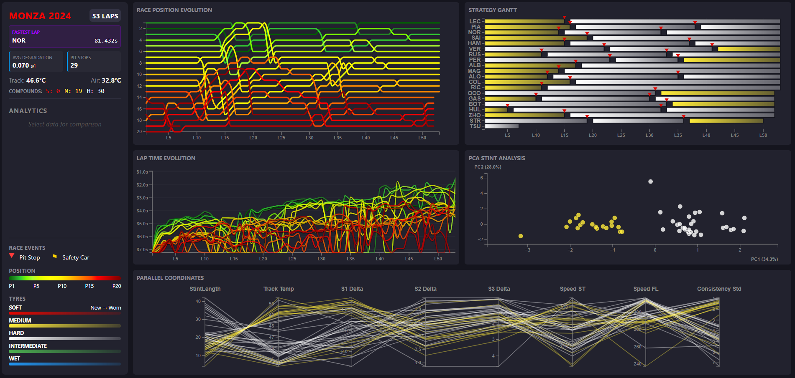

# F1 Race Strategy – Visual Analytics Dashboard

**Interactive visual analytics dashboard for Formula 1 race strategy**, built with **D3.js**, using the **2024 Italian Grand Prix at Monza** as a case study. It helps race-strategy engineers and journalists understand how tyre choices, degradation and pit stops shaped the result.

Team project (2 people) for the *Visual Analytics* course, Master of Science in Engineering in Computer Science, Sapienza University of Rome (A.Y. 2025/2026).



---

## What it shows

Five coordinated views and a summary sidebar, all linked by **brushing and linking**:

| View | What it encodes |
|---|---|
| **Race Position Evolution** | Position of every driver lap by lap, coloured on a green (P1) to red (P20) scale |
| **Lap Time Evolution** | Lap times per driver. Selecting a stint overlays a **live linear regression** of tyre degradation |
| **Strategy Gantt** | Each driver's stints, coloured by tyre compound (official F1 colours) with **luminance encoding tyre wear**, plus pit-stop markers |
| **PCA Stint Analysis** | Every stint projected onto the first two principal components, to spot clusters and **outliers** |
| **Parallel Coordinates** | Stint length, track temperature, sector deltas (S1–S3), speed traps and lap-time consistency |
| **Sidebar** | Race statistics (fastest lap, average degradation, pit stops, temperatures) and **on-demand box plots** comparing the selected stints against the whole race |

Selecting points in the PCA or a stint in the Gantt **highlights the same data in every view** and triggers **real-time computations** (regression lines, box-plot distributions).

## Insights from the dashboard

- **One stop beats two**: Leclerc won with a bold Medium→Hard one-stop strategy. Piastri was faster on track but lost the race in his second pit stop. The dashboard shows the *crossover point* where his fresher tyres stopped compensating for track position.
- **PCA outliers explain anomalies**: Hülkenberg's 5-lap opening stint and Tsunoda's 7-lap Hard stint (a technical failure before retiring) stand out immediately in the PCA and are explained by the parallel coordinates.
- **The human factor**: with the same tyres, drivers show very different degradation slopes, which reflects their tyre-management skill.

## Data pipeline

1. **Extraction**: `preprocessing/extract_monza_2024.py` downloads timing, telemetry, pit-stop and weather data from the official F1 feeds using the **FastF1** library, and builds lap-level and stint-level datasets (about 1,000 rows × 29 dimensions).
2. **Feature engineering**: laps are aggregated into **stints** (average lap time, degradation slope, stint length, tyre life, compound).
3. **Dimensionality reduction**: `App.py/App.py` standardises the features, runs **PCA** (2 components) and **K-Means** clustering with scikit-learn, and exports `data/pca_data.json` with explained variance and loadings for the biplot.
4. **Visualisation**: the web app loads the CSV/JSON files and renders the coordinated D3 views.

## Tech stack

- **Frontend**: JavaScript (ES6), **D3.js**, SCSS, Webpack, Babel
- **Data processing**: Python, **FastF1**, pandas, NumPy, SciPy, **scikit-learn** (PCA, K-Means)

## Getting started

**Run the dashboard** (requires Node.js 18+):

```bash
npm install
npm start          # development server with hot reload
npm run build      # production build in dist/
```

The processed data is already included in `data/`, so the steps below are only needed to regenerate it.

**Regenerate the data** (requires Python 3.9+):

```bash
pip install fastf1 pandas numpy scipy scikit-learn
cd preprocessing
python extract_monza_2024.py      # downloads and processes the race data
cd ../App.py
python App.py                     # PCA + clustering, writes data/pca_data.json
```

## Project structure

```
├── src/                 # D3 views: LineChart, RankingsChart, StrategyGantt, PCAChart, ParallelCoordinates
├── data/                # processed datasets used by the dashboard
├── preprocessing/       # FastF1 extraction script and raw outputs
├── App.py/              # PCA and clustering script
├── config/              # Webpack configuration
└── docs/                # report, presentation, project proposal
```

## Documents

- [Project report (PDF)](docs/vaReport.pdf)
- [Presentation (PDF)](docs/VAProjectPresentation.pdf)
- [Project proposal (PDF)](docs/Visual_Analytics_Project_Proposal.pdf)

## Team

Angela Di Giampaolo ([@angeladg02](https://github.com/angeladg02)) · **Bogdan Andrei Tutuianu** ([@bogX2](https://github.com/bogX2))
